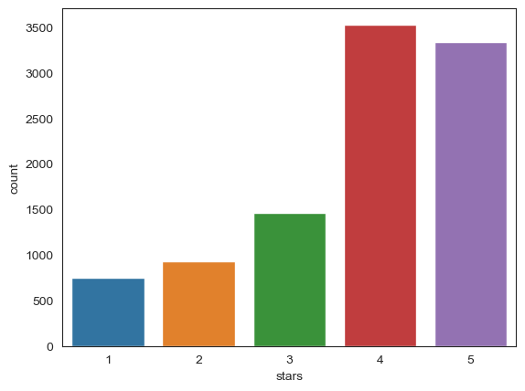
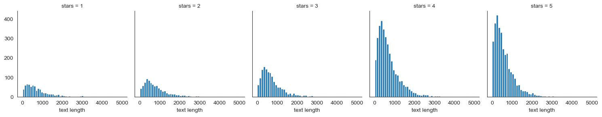
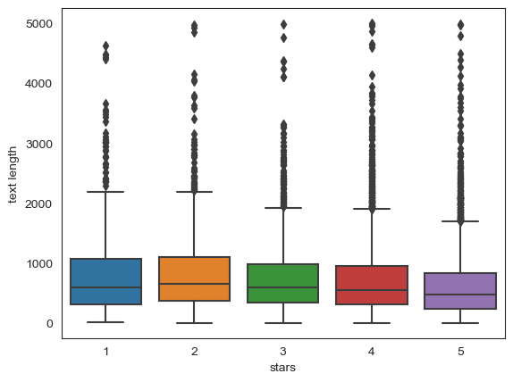
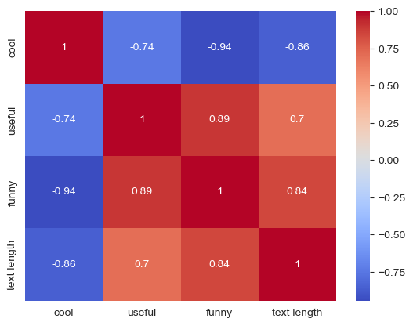
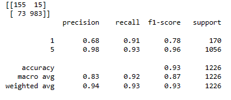

# Yelp Reviews - NLP Project

## Project Overview
This project analyzes the Yelp Reviews from 2013 and is sourced from [Kaggle](https://www.kaggle.com/c/yelp-recsys-2013). The primary objective of this project was to develop an algorithm capable of predicting whether a review rates 1 or 5 stars based solely on its text content. Moreover, the project aimed to uncover hidden trends and insights within the dataset, exploring aspects such as:

The distribution of reviews across different star ratings.
Variations in text lengths associated with different star ratings.
Correlations between the counts of "cool", "useful", and "funny" votes and the star ratings.

This initiative showcases an NLP model that discerns between 1-star and 5-star reviews, leveraging a sentiment analysis pipeline. The project yields key insights into the nature of the reviews, contributing to our understanding of user feedback patterns on Yelp.

## Libraries Used
numpy, pandas, matplotlib, seaborn, sklearn

## Exploratory Data Analysis
### Count Plot:
To get a good sense of the data, I plotted the count of the occurences of each star rating.

### Adding Text Length Column and Analyzing:
I added a "text length" column in order to see if this data could provide insight into the ratings.
The distribution of text lengths seems to be the same for all numbers of stars, but the actual amount of text reviews seem to be skewed towards higher stars. And the boxplot shows that there's so many outliers, so the "text length" might not be a useful predictor.

### Grouping by Stars and finding the Correlation:
I created a seperate data frame that grouped the reviews by the star rating, and measured the mean for the numerical columns ("cool", "useful", "funny", "text length"). I then found the correlation of the means and created a heat map based off this. The correlation shows that "funny", "useful", and "text length" are highly correlated, while "cool" and the rest of the measures are negatively correlated

### Data Pipeline and NLP algorithm
I developed a data processing pipeline for sentiment analysis that transforms text data into a numerical format using a bag-of-words model, followed by applying a Multinomial Naive Bayes classifier. After fitting the pipeline to my training data, I used it to make predictions on the test set, enabling the evaluation of the model's performance.

Please note that this was my final model, and I had previously tried implementing a TF-IDF normalization and creating a custom analyzer to my data pipeline, but found that it decreased the accuracy of my model. 

### Evaluation
I evaluated my model with a classification report, which showed a 93% overall accuracy, 91% recall for a 1 star review, a 93% recall for a 5 star review, and more. 

